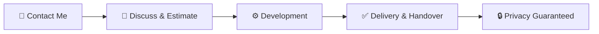

<div align="center">
  
# 

### *Beyond Code, Build Your Digital Ghost*

[](https://instagram.com/ellreynn)
[](https://facebook.com/ruyynn.dev)
[](https://github.com/ruyynn/CustomTools)
[](https://ghostdev.great-site.net/)

</div>

---

## 🎭 *Who Am I?*

<div align="center">
  
```diff
+ Hi! I'm Ruyynn, a developer from Indonesia.
+ I operate in the digital shadows, building secret weapons for your needs.
- Not just code, but solutions with maximum privacy.
```

</div>

_I'm a **custom tools engineer** focused on developing specific solutions—from advanced bot automation, layered security network tools, AI detectors (DeepSense), to professional websites. Every line of code I write is crafted specifically for you, leaving no unwanted traces._

---

## ✨ *Why Me? The Ghost Advantage*

<div align="center">
  
| 🔒 **100% Private** | ⚡ **Lightning Fast** | 🤝 **Flexible Price** | 🧩 **Zero to Hero** |
| :---: | :---: | :---: | :---: |
| NDA available. Full source code ownership goes to client. | Response within 24 hours, real-time progress tracking. | Price adjusted to your budget & needs. | Whatever your idea is, I'll build it from scratch. |

</div>

---

## 🚀 *Ghost Services*

<table>
  <tr>
    <td width="33%" valign="top">
      <h3 align="center">📊 Analysis & Report</h3>
      <p align="center">Pattern detection, emotional scoring, timeline generator, and in-depth data visualization.</p>
    </td>
    <td width="33%" valign="top">
      <h3 align="center">⚡ Custom CLI Tools</h3>
      <p align="center">Command-line tools with sleek Terminal UI, powerful and functional.</p>
    </td>
    <td width="33%" valign="top">
      <h3 align="center">🤖 Bot & Automation</h3>
      <p align="center">Report bots, auto-tools, and cross-platform automation scripts with high efficiency.</p>
    </td>
  </tr>
  <tr>
    <td width="33%" valign="top">
      <h3 align="center">🕵️ Network & Privacy Tools</h3>
      <p align="center">IP analyzer, VPN checker, DNS leak test, anonymity scorer, and complete OSINT tools.</p>
    </td>
    <td width="33%" valign="top">
      <h3 align="center">🔐 Encryption & String Tools</h3>
      <p align="center">Custom encryption, encoder/decoder, string manipulation, and advanced pattern analysis.</p>
    </td>
    <td width="33%" valign="top">
      <h3 align="center">✨ Anything You Request</h3>
      <p align="center">Have a unique idea? Let's discuss it! I'm ready to bring your digital dreams to life.</p>
    </td>
  </tr>
</table>

---

## 💼 *Featured Arsenal*

<div align="center">
  
### 🔮 **DeepSense**
> *Heavyweight AI Deepfake Detector*  
> Motion artifacts analysis, per-frame facial consistency, and voice matching with high accuracy.

### 📡 **NIUR – WiFi Tools**
> *Complete WiFi Security Toolkit*  
> Brute-force protection, signal scanner, deauth detector, hidden SSID revealer, and network security tester.

### 🧠 **WhyAlwaysMe**
> *Pattern Analysis Toolkit*  
> Emotional scoring, timeline generator, and behavioral pattern detection for in-depth analysis.

### 🔤 **ALZARSTR**
> *String Manipulation Master*  
> Custom encryption with key strength tester, encoder/decoder, and advanced text transformation.

### 🕶️ **MR-Anonymous**
> *Privacy & Network Toolkit*  
> Anonymity scorer, IP masking validator, and comprehensive privacy assessment tool.

</div>

> *Each tool above is a preview version. Full version is provided exclusively to clients with unlimited features.*

---

## 💰 *Investment Plans (Price Negotiable)*

<div align="center">
  
| Package | Price (Estimate) | Key Features | Delivery Time |
| :---: | :---: | :--- | :---: |
| **🚀 Starter** | $1.5 – $3 | Lightweight tools with 1–3 core features | 1-2 days |
| **⚡ Standard** | $4.5 – $9 | Complete tools with clean Terminal UI + documentation | 2-4 days |
| **💎 Premium** | $12+ | Complex tools (AI, Network, etc.) with unlimited features + 24/7 support | 5-10 days |

</div>

*Final price determined after discussing your needs. **Free revisions** until you're satisfied!*

> 💡 *For Indonesian clients, pricing is available in IDR (Rp 25k – 200k+). Contact me for details.*

---

## 👣 *How We Roll*



1.  **📞 Contact Me** – DM via [Instagram](https://instagram.com/ellreynn) or [Facebook](https://facebook.com/ruyynn.dev). Share your idea freely.
2.  **🎯 Discuss & Estimate** – I'll provide time estimate, price, and concept. Negotiations always open.
3.  **⚙️ Development** – Tools built from scratch according to specs. Progress trackable, revisions available anytime.
4.  **✅ Delivery & Handover** – Full source code sent. Tool name can be customized. 100% privacy guaranteed.

---

## 📞 *Contact & Order*

<div align="center">
  
### **Ready to build your dream tools or website?**

[](https://instagram.com/ellreynn)
[](https://facebook.com/ruyynn.dev)

**Or visit my website:**  
[](https://ghostdev.great-site.net/)

</div>

*🔒 NDA available. Full source code ownership belongs to client. Name can be kept confidential upon request.*

---

<div align="center">

**© 2026 Ruyynn – Custom Tools Builder Indonesia**  
*All tools crafted precisely for you. No trace, no regret.*

</div>
